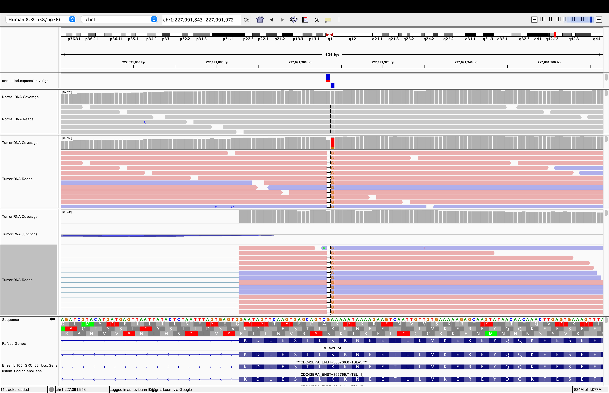

## Results of the manual review of the HCC1395 candidates

Of the 321 neoantigen candidates predicted from the Immuno pipeline 80 were accepted. 

### Mutation Not Called

#### JUP

Deletion of 42 bases looks real in DNA and RNA (masked in DNA due to softclipping). RNA deletion obviously there by read pattern even though deletion not called (manually filling in RNA VAF/expression values using a RNA depth of 100 which is average for the exon). No proximal variants. No unexpected RNA splicing. Majority of reads support the chosen transcript.

#### LOXL2

Deletion of 21 bases looks real in DNA but there are no called deletion in the RNA. There are reads that splice to one another in the same pattern as the deletion -- this seems to be enough evidence to accept this one. There is a SNV right after the deletion in the RNA which is probably a result of a misalignemnt of the deletion. No exon skipping. Majority of reads support the chosen transcript.

### Incorrect Transcript

#### CFAP410

Deletion of 24 bases looks real in DNA but there are no called reads of evidence in the RNA. The RNA does not support the chosen transcript at all. No proximal variants that effect the 51mer. Rejecting for no RNA evidence.

#### F2

Somatic variant looks real in DNA but is in a region of relatively low coverage in RNA (2 reads with variant is found at RNA level). 1 proximal germline variant, results in no AA change. RNA reads dont support the chosen transcript, sashimi plot shows that the chosen transcript isnt being utilized. 

#### GPR68

Deletion of 20 bases looks real in DNA but has 1 read supporting that variant in RNA despite being in a region with a lot of coverage. Abnormal splicing pattern/there are unannotated transcripts in the vicinity. Can't figure out if transcript annotation is correct. 

#### ABL2

Somatic variant looks real in DNA and RNA. No proximal variants. Unfortunately, I think this transcript may be incorrect. The variant is found in what several other transcripts call an intron. The chosen trnascript has an exon spanding through the intron but visually it doesn't seem that the read support this transcript. However, there are only 138/~500 read that span between the two exons, maybe supporting the chosen transcript. 

### Dinucleotide Miscall

### Misaligned insertion between DNA and RNA

#### C8orf76

Insertion of 7 bases looks real in DNA and RNA although the RNA  insertion calls are misaligned (manually fill in the RNA expression levels for this candidate). This insertion happens in-phase with the SNV listed above. If we were to manufacture this candidate we would have to account of the SNV in the 51mer (purple letter in 51mer has been changed to account for SNV). The 51mer is also shortened because the insertion causes a frameshift which results in a stop codon. transcript annotation looks correct. 

### Complex Variant

#### CDC42BPA

This somatic variant always happens in phase with a C deletion right before it (see candidate above this one). The deletion combined with the SNV results in the same AA change BUT the deletion causes a frameshift where the next AA is a stop codon, therefore I think we cannot accept this candidate because only half of the classI peptide would be captured in the 51mer.The SNV is the better binder so if we cannot target this we have to reject.

### Reference Match

#### FGFR1

# ONES TO CHECK

Somatic variant looks real in DNA and RNA. There are three proximal variants. (1) There is a missense variant  in upstream 51mer region , which is another neoantigen candidate. (2) A missense somatic variant  in downstream 51mer region ,leads to a change from V to M (3) A  synonymous somatic variant  in downstream 51mer region. No unexpected RNA splicing. Majority of reads support the chosen transcript.  51 mer spans  downstream.  -- All these variants are accounted for in the 51mer.
